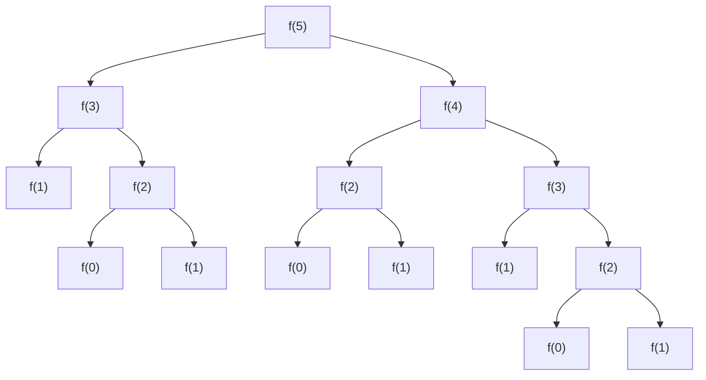
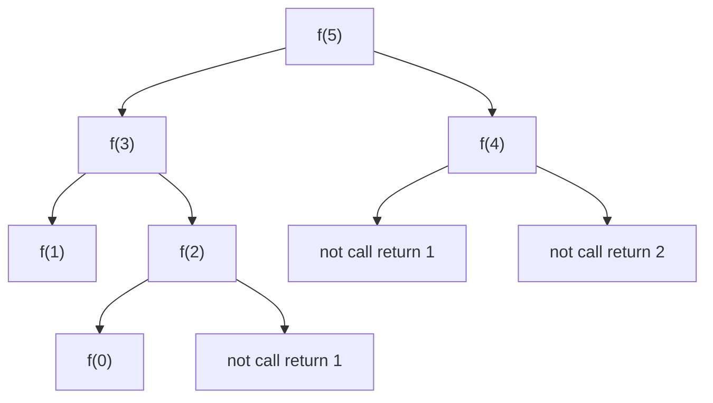

#  Fibonacci

|  值   |  0   |  1   |  1   |  2   |  3   |  5   |  8   |  13  |
| :---: | :--: | :--: | :--: | :--: | :--: | :--: | :--: | :--: |
| index |  0   |  1   |  2   |  3   |  4   |  5   |  6   |  7   |


## 1.直接递归调用

> f(5) = 15  
>
> f(4) = 9 
>
> f(3) = 5

> $$
> 时间复杂度 O(2^n)
> $$

```js
function fibonacci(n){
    if(n < 2) return n;
    return f(n-2) + f(n-1);
}
```



> 问题分析：递归调用了太多的相同的值，运行的时候很容易出现 stack out --过渡递归


## 2.优化递归

> 开辟空间 保存已经计算过的值

$$
时间复杂度O(n)
$$


|  值   |  0   |  1   |  1   |  2   |  3   |  5   |
| :---: | :--: | :--: | :--: | :--: | :--: | :--: |
| index |  0   |  1   |  2   |  3   |  4   |  5   |



```js
let n = 1000
let a = new Array(n)
a.fill(-1)


function fibonacci(n){
  if(n < 2) {
    a[n] = n; 
    return n;
  }
  if (a[n-2] == -1){
    a[n-2] = fibonacci(n-2);
  }
  if(a[n-1] == -1){
    a[n-1] = fibonacci(n-1);
  }
  return a[n-2] + a[n-1];
}

console.log(fibonacci(n));

```


> 使用了空间 把原先的 f(5) = 15  优化成了 f(5) = 5 
