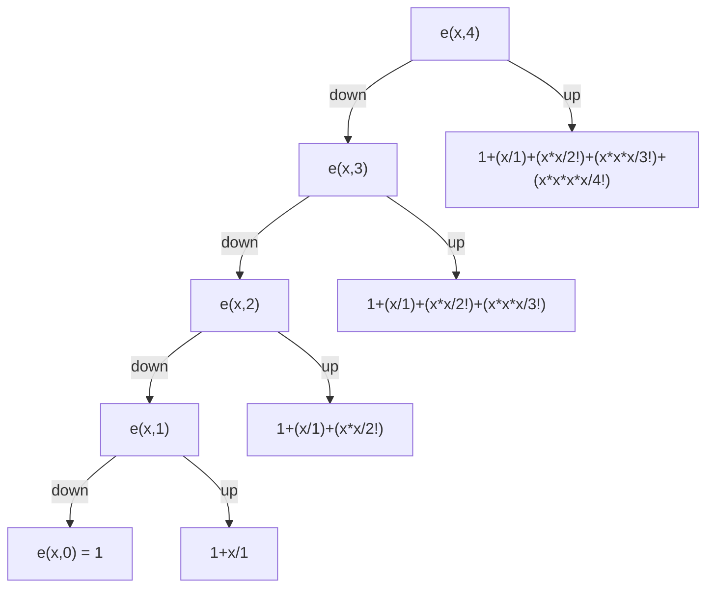
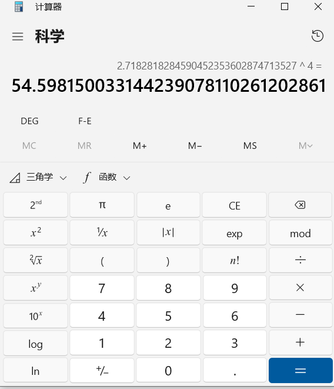
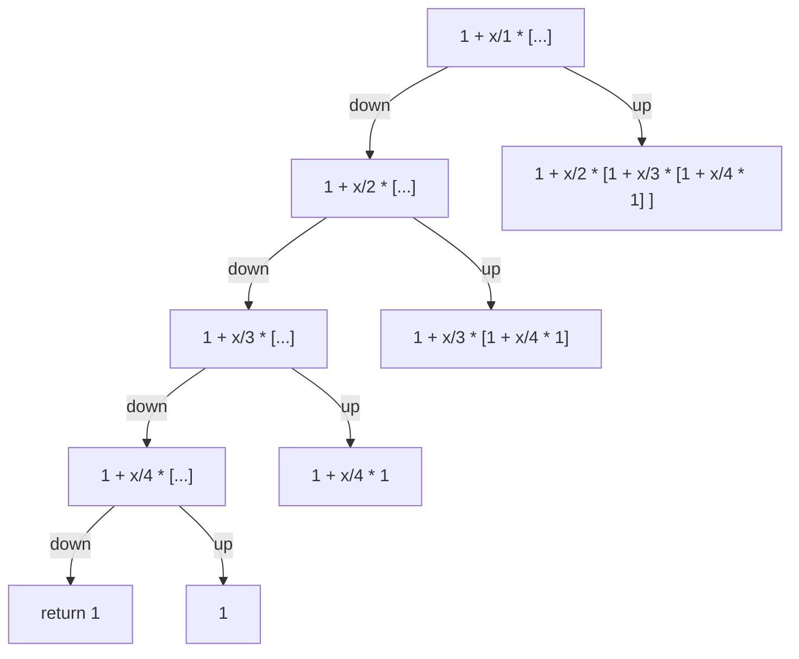

# 使用递归计算 Talor

$$
e^x = 1 + \frac {x}{1} + \frac {x^2}{2!} +  \frac {x^3}{3!} +  \frac {x^4}{4!} + ... + \frac {x^n}{n!}
$$

> n = x  j 代表有多少位数相加


## 1. 递归解决



```javascript
/**
 * function 1 
 */
let factorial = 1;
let power = 1;
let total = 0;
function Talor1(n,j){
  if(n === 0) return 1;
  total = Talor1(n-1,j) 
  factorial = factorial * j;
  power = power * n;
  total += factorial/power
  return total
}


Talor1(500,4);
console.log(total); // 54.598150033144265

Talor1(600,4);
console.log(total); // NaN possible out stack
```




## 2.优化方案

> 如果 Talor1(600,4);  出现了 NaN 的问题

$$
e^x = 1 + \frac {x}{1} + \frac {x^2}{2!} +  \frac {x^3}{3!} +  \frac {x^4}{4!} + ... + \frac {x^n}{n!}
$$

$$
e^x = 1 + \frac{x}{1} \space [1+ \frac{x}{2} + \frac{x^2}{2\times3} + \frac{x^3}{2\times3\times4}]
$$

$$
e^x = 1 + \frac{x}{1} \space [1+ \frac{x}{2} \space [1 + \frac{x}{3} + \frac{x^2}{3\times4}]]
$$

$$
e^x = 1 + \frac{x}{1} \space [1+ \frac{x}{2} \space [1 + \frac{x}{3}\space [1 + \frac{x}{4}]]]
$$




```js
let total2 = 0;
function Talor2(k,n,j){
  if(k === n+1) return 1;
  total2 += 1 + j/k * Talor2(k+1,n,j);
  return total2
}

Talor2(1,7000,4); // 7000 已经是极限了，然后就 stack out
console.log(total2);


// 其实可以这么做，感觉比我自己写的要好
let total4 = 1;
function Talor4(n,j){
  if (n==0) return total4
  total4 += 1 + j/n * total4;
  return Talor4(n-1,j);
}


```

## 3.FOR 循环最优解

```js
// for 循环的方式计算
let total3 = 1;
function Talor3(n,j) {
  for(let i = n; i > 0; i-- ){
    total3 = 1 + j / i * total3;
  }
}
Talor3(18000,4); // 轻松18000次循环
console.log(total3);
```

